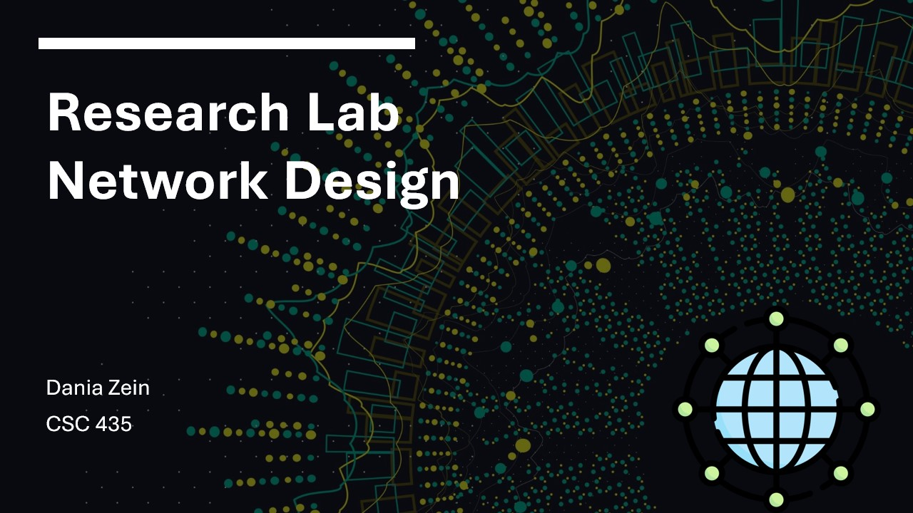
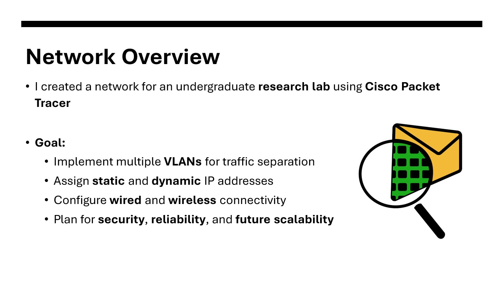
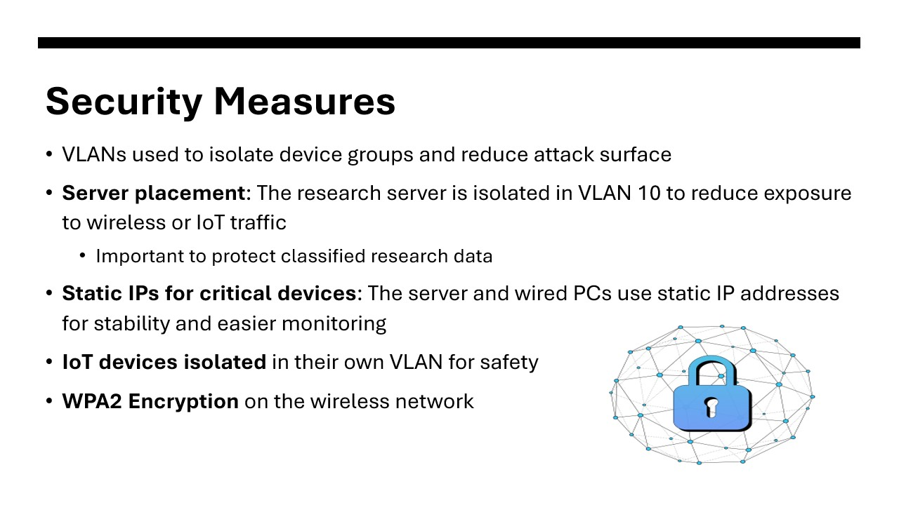

# Bioinformatics-Research-Lab-Network-Design
This is my final project for CSC435, where I designed a network for a bioinformatics research lab using Cisco Packet Tracer. The network features VLANs for traffic separation, wired and wireless connectivity, and basic security. It supports research PCs, student devices, and IoT equipment, with potential for future improvements.

